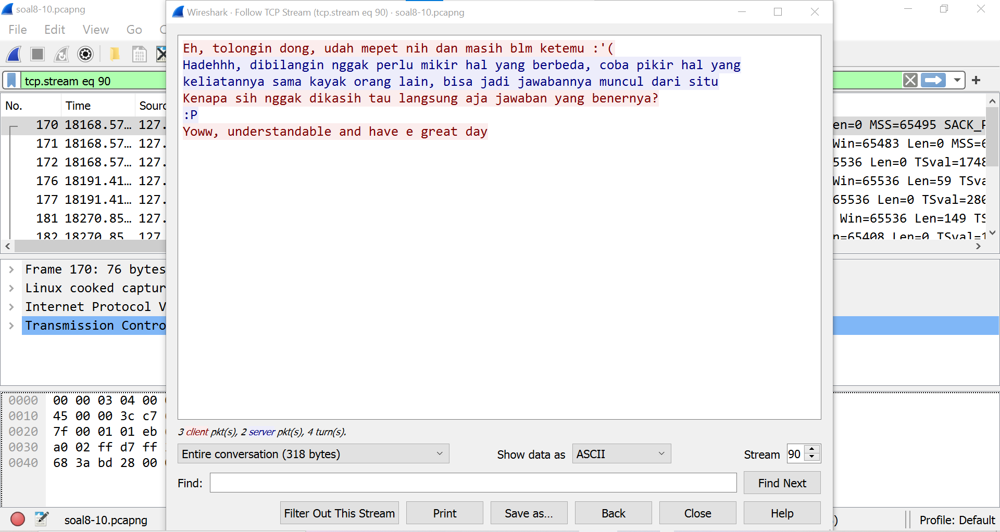

# Jarkom-Modul-1-ITB08-2022

## Anggota:
| Nama                      | NRP        |
|---------------------------|------------|
| Salsabila Briliana A. S.  | 5027201003 |
| Muhammad Rifqi Fernanda   | 5027201050 |
| Gilang Bayu Gumantara     | 5027201062 | 

## Soal 4
---
Filter sehingga wireshark hanya mengambil paket yang berasal dari port 21!

### Solution
---
Karena yang dicari adalah paket yang berasal dari port 21, untuk filternya menggunakan 'tcp.src' karena protocol yang digunakan port 21 adalah tcp.
Masukkan filter ke dalam display filter.
tcp.srcport == 21

## Soal 5
---
Filter sehingga wireshark hanya mengambil paket yang berasal dari port 443!

### Solution
---
Karena yang dicari adalah paket yang berasal dari port 443, untuk filternya menggunakan 'tcp.src' & 'udp.src' karena protocol yang digunakan port 443 adalah tcp dan udp.
Masukkan filter ke dalam display filter.
tcp.srcport == 443 || udp.srcport == 443

## Soal 6
---
Filter sehingga wireshark hanya menampilkan paket yang menuju ke lipi.go.id !

### Solution
---
pertama cari ip dari website lipi.go.id menggunakan cmd
tracert lipi.go.id

setelah ditemukan ip dari websitenya, masukkan filter ke dalam display filter, karena yang dicari adalah paket yang menuju ke website, filternya menggunakan 'ip.dst'
ip.dst == 203.160.128.158

## Soal 7
---
Filter sehingga wireshark hanya mengambil paket yang berasal dari ip kalian!

### Solution
---
pertama cari ip dari website lipi.go.id menggunakan cmd
'ipconfig'

setelah ditemukan ip dari device kita, masukkan filter ke dalam display filter, karena yang dicari adalah paket yang berasal dari device kita, filternya menggunakan 'ip.src'
ip.src == 192.168.210.71

## Study Case Soal 8-10
---
Di sebuah planet bernama Viltrumite, terdapat Kementerian Komunikasi dan Informatika yang baru saja menetapkan kebijakan baru. Dalam kebijakan baru tersebut, pemerintah dapat mengakses data pribadi masyarakat secara bebas jika memang dibutuhkan, baik dengan maupun tanpa persetujuan pihak yang bersangkutan. Sebagai mahasiswa yang sedang melaksanakan program magang di kementerian tersebut, kalian mendapat tugas berupa penyadapan percakapan mahasiswa yang diduga melakukan tindak kecurangan dalam kegiatan Praktikum Komunikasi Data dan Jaringan Komputer 2022. Selain itu, terdapat sebuah password rahasia (flag) yang diduga merupakan milik sebuah organisasi bawah tanah yang selama ini tidak sejalan dengan pemerintahan Planet Viltrumite. Tunggu apa lagi, segera kerjakan tugas magang tersebut agar kalian bisa mendapatkan pujian serta kenaikan jabatan di kementerian tersebut!

## Soal 8
---
Telusuri aliran paket dalam file .pcap yang diberikan, cari informasi berguna berupa percakapan antara dua mahasiswa terkait tindakan kecurangan pada kegiatan praktikum. Percakapan tersebut dilaporkan menggunakan protokol jaringan dengan tingkat keandalan yang tinggi dalam pertukaran datanya sehingga kalian perlu menerapkan filter dengan protokol yang tersebut.

### Solution
---
Melakukan follow tcp stream untuk menemukan percakapan 2 mahasiswa. Setelah ditelusuri, terdapat percakapan pada tcp stream 12, 41, dan 90.

1. tcp.stream eq 12

2. tcp.stream eq 41

3. tcp.stream eq 90

## Soal 9
---
Terdapat laporan adanya pertukaran file yang dilakukan oleh kedua mahasiswa dalam percakapan yang diperoleh, carilah file yang dimaksud! Untuk memudahkan laporan kepada atasan, beri nama file yang ditemukan dengan format [nama_kelompok].des3 dan simpan output file dengan nama “flag.txt”.

### Solution
Pada percakapan tcp stream 12 disebutkan bahwa akan mengirim file melalui port 9002 sehingga dilakukan filter tcp.port == 9002

Kemudian melakukan follow tcp stream dan menemukan filenya. File tersebut disimpan dalam bentuk raw dan di rename menjadi ITB08.des3.

Setelah itu file akan di decrypt menggunakan openssl dan hasilnya disimpan pada flag.txt (openssl des3 -d -in ITB04.des3 -out flag.txt)

## Soal 10
Temukan password rahasia (flag) dari organisasi bawah tanah yang disebutkan di atas!

### Solution
Percakapan pada tcp stream 12 terdapat clue untuk password pada file yang dikirim, yaitu nama karakter anime kembar 5. Saat menelusuri di internet diketahui bahwa passwordnya adalah nama keluarga dari karakter kembar 5 anime tersebut, yaitu "nakano".

## Kendala
Pada awalnya belum mengetahui password dari file yang ditemukan, kemudian setelah waktu pengerjaan soal shift selesai kami baru menemukan passwordnya dan mendemokannya pada asisten penguji.
